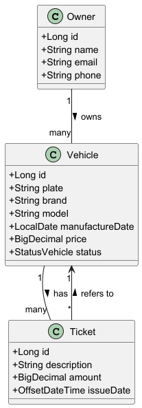

# Getting Started

## Objective
This project is an exercise from the AlgaWorks Ignição Spring REST course.

## Description's Project
This project is a small traffic management API. It consists of three entities: Vehicle, Ticket, and Owner.
This API should provide endpoints for a CRUD operation and other operations that perform a business process.

## Technologies used

<ul>
  <li>Java - 17</li>
  <li>Spring boot</li>
  <li>Spring Boot Starter Web</li>
  <li>Spring Boot Starter Data JPA</li>
  <li>Spring Boot Starter Validation</li>
  <li>Mysql</li>
  <li>Flywaydb</li>
  <li>Modelmapper</li>
  <li>Lombok</li>  
  <li>Running in port 8080</li>
</ul>

## Endpoints-api

[📥 Download JSON file](src/main/resources/postman/Ignição%20Spring%20REST.postman_collection.json)

## UML Diagram

